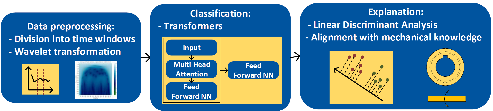

## Pipeline description:
In this repository, we provide a framework for time series classification explanation. 

1.	We have applied wavelet feature extraction on wind turbine data to find the frequency-time related features. (This step can be skipped or other feature extraction methods can be used.)
2.	We have used transformers to classify healthy and faulty samples.
3.	For the explanation, we have applied Linear Discriminant Analysis on attention data extracted from transformers. Here, we can find the important frequencies that distinguish between healthy and faulty conditions.
We apply the proposed framework to three real wind turbine use cases: 
•	NREL: Link to the data (https://data.openei.org/submissions/738) [1] 
•	DFIG-Test Rig: Link to the data (https://doi.org/10.15128/r28049g5063.) [2] 
•	Fraunhofer LBF: (https://zenodo.org/records/11820598) [3] 

## How to run the code?
•	**Install the requirements file**. We have used Python 3.10.12. For other Python versions, maybe packages need to be adapted.
•	**You need to run only the main.py file**.
•	After running main.py file, we will obtain the classification results as csv files. Furthermore, attention data will be stored in the explanation folder. **After the main.py file has been running, you can run the attention_explanation.py to find the important features that helped the transformer to classify your samples**. (We have already stored an example of attention data in the explanation folder that you can use.)
* Each folder (NREL, DFIG-Test Rig, and Fraunhofer LBF) shows the code for each use. Because the data were stored differently for each use case, we needed to read the data files differently. However, the implemented method is the same for all the use cases.
* If you use this code in your work, please cite our paper “Explainable Artificial Intelligence for Time Series Using Attention Mechanism: Application to Wind Turbine Fault Detection”. 🤗

### Parameter setting (optional):
•	There are some general parameters: Learning rate, epochs, n_heads, n_layes, window size, optimizer, batch-size, … 
•	We have used wavelet feature extraction: we can also set frequency range and wavelet_type.

[1] S. Sheng, ‘‘Wind turbine gearbox vibration condition monitoring benchmarking datasets,’’ NREL National Wind Technology Center, Boulder, CO, Report No. NREL/TP-5000-54530, 2012. 
[2] D. Zappala, N. Sarma, S. Djurović, C. Crabtree, A. Mohammad, and P. Tavner, ‘‘Electrical & mechanical diagnostic indicators of wind turbine induction generator rotor faults,’’ Renewable energy, vol. 131, pp. 14–24, 2019. 
[3] A. Mostafavi and A. Friedmann, ‘‘Wind turbine condition monitoring dataset of Fraunhofer LBF,’’ Scientific data, vol. 11, no. 1, p. 1108, 2024.
